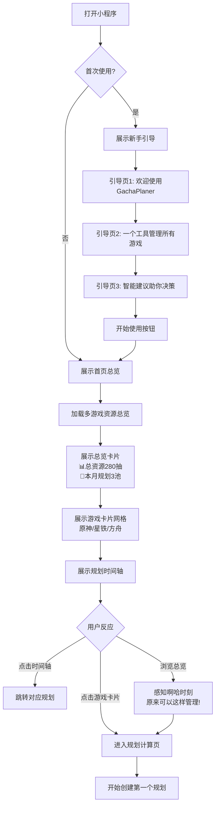
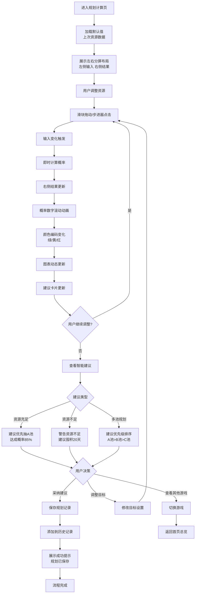
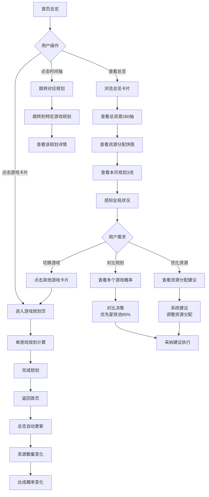
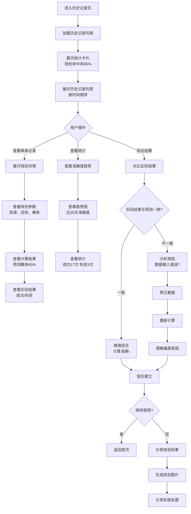

# UX Design Specification - GachaPlaner

**Author:** Waston
**Date:** 2026-04-03

---

## 执行摘要

### 项目愿景

GachaPlaner 是一款微信小程序，为二次元手游玩家提供跨游戏的智能抽卡规划服务。核心愿景是让玩家发现"原来我的多款游戏抽卡规划可以串联起来"——打破游戏间的规划孤岛，提供从"计算器"到"规划顾问"的价值升级。

**核心价值主张**：
- 多游戏统一管理（市场空白）
- 智能规划建议（从未实现）
- 微信小程序便利性（天然优势）

### 目标用户

**理性规划型（40%）**
- 年龄：18-30岁，大学生、职场新人
- 特征：月预算50-300元，同时玩2-3款游戏
- 需求：精准计算、多游戏管理、长期规划
- 使用场景：新卡池预告后详细规划，每周使用3-5次

**收藏成就型（20%）**
- 年龄：25-35岁，资深玩家
- 特征：收入稳定，追求全收集
- 需求：长期规划（3-6个月）、历史数据分析、全图鉴管理
- 使用场景：提前规划多个限定卡池，资源优化

**情感驱动型（30%）**
- 年龄：18-24岁，年轻玩家
- 特征：情感决策为主，但仍需理性参考
- 需求：简单概率查看、快速决策支持、易懂界面
- 使用场景：看到喜爱角色，快速查看是否该抽

**用户能力与场景**：
- 技术熟练：熟悉手机操作和微信小程序，期望"一看就会"
- 使用设备：手机为主（80%），微信生态内即用即走
- 使用时机：预告期查看概率、规划期制定策略、追踪期验证结果

### 关键设计挑战

**1. 信息架构的复杂性**
- 多游戏、多卡池、多时间维度的数据组织
- 避免用户在复杂输入和查看中迷失
- 让复杂性变得简单直观

**2. 概率信息的可理解性**
- 数学概率对普通用户晦涩难懂
- 让"65%概率"变得有直观意义
- 让数据讲故事，而不是堆砌数字

**3. 智能建议的信任建立**
- 用户凭什么相信工具的建议
- 让建议看起来权威可靠
- 建立信任，让用户敢于采纳建议

**4. 微信小程序的交互约束**
- 屏幕空间有限，功能不能少
- 在有限空间内提供完整功能
- 信息密度与简洁性的平衡

### 设计机会

**1. "啊哈时刻"的惊喜设计**
- 多游戏资源总览的首次展示
- 让用户第一次就感到"这太有用了！"
- 通过视觉冲击建立第一印象

**2. 游戏化体验融入**
- 抽卡本身就是游戏行为
- 成就系统、规划命中率、角色收集进度
- 让工具变得有趣，提升用户粘性

**3. 微信生态的社交优势**
- 规划结果分享到朋友圈
- 朋友间的推荐和背书
- 通过社交传播获取用户

**4. 情感化设计**
- 理性规划工具也可以有温度
- 为情感驱动型用户提供简洁友好界面
- 平衡理性与情感，服务不同用户类型

## 核心用户体验

### 定义体验

**核心动作**：查看抽卡规划预测

用户最频繁、最核心的动作是查看自己的抽卡规划预测——包括达成目标的概率、所需资源预估、智能建议。这不是简单的概率计算展示，而是"我的规划会怎样"的预测性洞察。

**核心价值实现**：
- 用户设定目标（如"满命角色"）
- 工具展示预测（达成概率、资源需求、建议行动）
- 用户获得决策依据（"该不该抽"的答案）

**关键区别**：
- 不是：用户输入 → 看到概率数字 → 自己判断
- 而是：用户输入 → 看到预测建议 → 直接决策

### 平台策略

**主要平台**：微信小程序

**交互模式**：
- 触摸交互为主（点击、滑动、长按）
- 垂直屏幕布局，信息密度需精心设计
- 手指操作友好：触摸目标 ≥ 44px，避免误触

**平台约束**：
- 包体积限制：2MB主包（预估1MB，安全）
- 渲染性能：Canvas图表渲染 < 500ms
- 本地存储：10MB上限（纯文本数据，充足）

**平台能力利用**：
- 本地存储：数据持久化，离线可用
- Canvas渲染：概率分布图表、资源曲线
- 微信分享：规划结果分享到好友/朋友圈（Post-MVP）

**微信设计规范遵循**：
- 导航模式：Tab Bar主导航 + 页面栈详情页
- 色彩规范：品牌色、功能色、中性色
- 字体规范：微信Sans字体，层级清晰
- 组件规范：使用微信原生组件，体验一致

### 轻松交互

**零思考操作**：

1. **数据输入零负担**
   - 资源输入快速简单，不感觉"填表"
   - 智能默认值：记住上次输入，自动填充
   - 快速调整：滑块、步进器等轻松控件
   - 即时反馈：输入即计算，无需点击"计算"

2. **结果查看零计算**
   - 用户不做任何数学运算
   - 概率信息可视化：图表、颜色、进度条
   - 文字建议直接可执行："建议优先抽A池"
   - 关键信息突出：达成概率、资源缺口、建议行动

3. **游戏切换零摩擦**
   - 多游戏之间切换流畅自然
   - Tab切换或下拉选择，无需重新设置
   - 资源总览始终可见，随时掌握全局

**自动发生的行为**：

- **自动持久化**：数据变更即保存，用户无需手动保存
- **自动计算**：输入变化即重新计算，无需点击按钮
- **自动同步**：多游戏资源总览自动更新，无需刷新
- **自动提醒**：资源不足、保底进度自动提示

### 关键成功时刻

**"这更好"的时刻**：

1. **首次打开的多游戏总览**
   - 时机：用户第一次使用，看到多游戏资源总览
   - 感受："原来我的所有游戏可以一起管理！"
   - 意义：第一个"啊哈时刻"，核心价值感知

2. **第一次看到智能建议**
   - 时机：用户创建第一个规划，看到建议
   - 感受："它直接告诉我该怎么做！"
   - 意义：从"计算器"到"顾问"的价值升级

3. **第一次验证准确度**
   - 时机：用户查看历史记录，对比实际结果
   - 感受："计算结果和实际完全一样！"
   - 意义：信任建立的关键转折点

**失败会毁掉体验的交互**：

- **概率计算错误**：信任瞬间崩塌，用户永久流失
- **数据丢失**：用户努力白费，挫败感强烈
- **界面卡顿**：破坏流畅感，影响使用频率
- **建议误导**：用户采纳后失败，信任受损

### 体验原则

**原则1：规划预测优先于概率计算**
- 用户想看的是"我的规划预测"，不是冷冰冰的数学
- 展示重点：达成目标的可能性、资源预估、建议行动
- 概率数字只是支撑，预测建议才是主角

**原则2：多游戏一目了然**
- 核心价值在于"串联"，必须一眼看到全貌
- 多游戏资源总览是第一屏的核心
- 游戏间的关系和资源流动要可视化

**原则3：零计算负担**
- 用户不做数学，工具做数学
- 输入即计算，无需额外操作
- 结果展示要直观：图表、颜色、文字建议

**原则4：信任建立在准确性**
- 计算必须正确，符合用户设定
- 数据来源透明（官方公式）
- 提供验证机制（历史准确度）

**原则5：微信原生体验**
- 遵循微信小程序设计规范
- 利用微信生态能力（分享）
- 即用即走，轻量化交互

## 期望情感响应

### 主要情感目标

**掌控感 + 信心**

**掌控感**
- 用户清楚自己的资源状态和规划路径
- 信息透明可见，操作主动可控
- "我知道我的所有游戏状况，我知道该怎么做"

**信心**
- 用户相信工具的计算和建议
- 敢于依据建议做出抽卡决策
- "这个建议可靠，我可以放心执行"

### 情感旅程映射

**首次发现阶段**：好奇 → 惊喜 → 兴趣
- 打开小程序，看到多游戏总览
- "原来可以这样管理！"
- 产生探索欲望，想要尝试

**核心体验阶段**：轻松 → 掌控 → 信心
- 输入资源数据：简单快速，无负担
- 查看规划预测：一目了然，清晰明了
- 看到智能建议：有理有据，可信可靠
- "我现在清楚状况了，我知道该怎么做了"

**任务完成阶段**：安心 → 满足 → 信任
- 制定好规划：心里有数，安心决策
- 验证准确度：果然准确，满足信任
- 成功抽到目标：感谢工具，推荐他人

**出错处理阶段**：理解 → 引导 → 解决
- 数据输入错误：友好提示，引导修正
- 计算存疑时：展示依据，解释逻辑
- 避免用户感到挫败或困惑

**重复使用阶段**：熟悉 → 依赖 → 推荐
- 成为习惯性工具
- 信任感持续累积
- 主动推荐给朋友

### 微情感识别

**核心微情感**

**1. 信心 vs 怀疑**
- 信心来源：
  - 计算透明：展示公式、数据来源
  - 建议权威：有理有据，逻辑清晰
  - 验证机制：历史准确度可查
- 设计支持：数据来源标注、计算过程可视化、准确度统计

**2. 掌控感 vs 迷茫**
- 掌控感来源：
  - 信息清晰：总览可见，层级分明
  - 操作简单：输入即计算，无需复杂流程
  - 全局把控：多游戏状态一目了然
- 设计支持：固定总览位置、简化操作路径、全局导航

**辅助微情感**

**3. 轻松感 vs 焦虑**
- 轻松感来源：
  - 自动计算：无需用户做数学
  - 快速输入：智能默认值，轻松控件
  - 即时反馈：无需等待，立即可见
- 设计支持：自动保存、默认值、滑块控件

**4. 信任感 vs 怀疑**
- 信任感来源：
  - 准确可靠：计算正确，数据真实
  - 持续稳定：多次使用，始终可靠
  - 透明公开：数据来源、计算方法透明
- 设计支持：版本信息、数据来源、历史验证

**5. 惊喜感 vs 平淡**
- 惊喜感来源：
  - 多游戏串联：第一次看到总览的冲击
  - 智能建议：从"计算器"到"顾问"的价值发现
  - 个性化体验：自定义游戏模板的成就感
- 设计支持：视觉冲击、价值对比、成就系统

### 设计影响

**掌控感驱动的设计**

1. **信息架构**
   - 多游戏资源总览始终可见（顶部固定或Tab导航）
   - 清晰信息层级：总览→游戏详情→卡池规划
   - 用户随时知道自己在哪里、能做什么

2. **交互设计**
   - 简单直接的操作路径：≤3步完成核心任务
   - 即时反馈：输入即计算，无需点击"计算"按钮
   - 可撤销/修改：所有数据可编辑，无不可逆操作

3. **视觉设计**
   - 关键信息突出：达成概率、资源缺口、建议行动
   - 进度可视化：保底进度条、资源状态图
   - 界面呼吸感：留白充足，不拥挤不混乱

**信心驱动的设计**

1. **计算透明**
   - 显示计算依据："基于官方概率公式计算"
   - 展示数据来源：游戏版本、数据更新日期
   - 提供验证机制：历史规划准确度统计

2. **建议权威**
   - 智能建议有理有据："建议优先抽A池，因为达成概率85%"
   - 展示建议逻辑：为什么这样建议
   - 风险提示清晰："当前资源不足，建议囤积XX天"

3. **数据可靠**
   - 数据版本标注：每个游戏数据版本号和日期
   - 错误提示友好："数据可能过期，请核对官方公告"
   - 数据自动保存：防止丢失，建立信任

**负面情绪预防**

- **预防困惑感**：信息层级清晰、导航明确、引导提示
- **预防怀疑感**：计算透明、数据来源标注、准确度验证
- **预防挫败感**：操作简单、自动保存、错误可撤销
- **预防焦虑感**：性能优化、加载提示、即时反馈

**惊喜时刻设计**

- **首次总览冲击**：多游戏资源总览的视觉设计要惊艳
- **第一次建议**：智能建议的价值感知要强烈
- **准确度验证**：历史数据验证的满足感要明确
- **自定义成功**：自定义游戏模板的成就感要庆祝

### 情感设计原则

**原则1：掌控优先**
- 用户必须感到掌控局面，而非被数据淹没
- 所有设计决策问："这增强还是削弱用户掌控感？"

**原则2：信心建立**
- 每个交互都要增强用户信心
- 计算透明、建议有据、数据可靠是信心的三大支柱

**原则3：轻松无负担**
- 使用过程必须轻松愉快，零焦虑
- 自动化一切可自动化的，减少用户操作负担

**原则4：透明建立信任**
- 数据来源、计算方法、建议逻辑全部透明
- 不隐藏任何可能影响信任的信息

**原则5：惊喜创造推荐**
- 在关键节点设计惊喜时刻
- 惊喜驱动分享，分享带来用户

## UX模式分析与灵感

### 灵感产品分析

**跨界灵感来源：股票/理财APP + 游戏化设计**

GachaPlaner没有直接竞品，因此我们从两个跨领域汲取灵感：

**股票/理财APP的严谨数据化**
- **代表产品**：股票交易App、理财规划工具、资产管理平台
- **核心优势**：
  - 数据可视化直观清晰
  - 多维度数据一目了然
  - 历史追踪详尽可靠
  - 智能建议有理有据
  - 关键信息突出显示

**游戏化设计的趣味性**
- **代表产品**：游戏成就系统、习惯养成App、游戏进度追踪工具
- **核心优势**：
  - 进度系统激励持续使用
  - 成就系统创造满足感
  - 即时反馈增强互动性
  - 情感化设计建立连接
  - 社交分享驱动传播

**融合策略**：
- 数据准确严谨（理财级准确性）+ 呈现有趣生动（游戏级体验）
- 专业建议权威（理财顾问级）+ 表达轻松友好（游戏助手风格）
- 历史数据追踪（理财记录详尽）+ 成就系统激励（游戏进度感）

### 可迁移UX模式

**从股票/理财APP迁移的模式**

**1. 数据可视化模式**
- **资产总览 → 多游戏资源总览**
  - 股票App："总资产 ¥100,000，今日 +2.5%"
  - GachaPlaner："总资源 280抽，本周 +10抽"
  - 饼图展示资产配置 → 饼图展示资源分配（原神40%、星铁35%、明日方舟25%）
  - 应用场景：首页资源总览卡片

- **K线走势图 → 概率分布曲线**
  - 股票App：K线图展示价格走势，颜色区分涨跌
  - GachaPlaner：概率曲线展示达成概率，颜色区分风险等级
  - 绿色=高概率安全、黄色=中等风险、红色=低概率危险
  - 应用场景：规划详情页概率展示

- **自选股列表 → 多游戏快速切换**
  - 股票App：自选股列表，涨跌幅一目了然，快速切换
  - GachaPlaner：多游戏列表，达成概率一目了然，快速切换
  - 应用场景：主导航或侧边栏

**2. 数据追踪模式**
- **历史走势 → 资源变化趋势**
  - 股票App：30天股价走势图，标注重要事件
  - GachaPlaner：30天资源变化曲线，标注卡池开启、抽卡结果
  - 应用场景：历史数据页趋势图

- **收益统计 → 规划准确度统计**
  - 股票App："本月收益 +15%，累计收益 ¥5,000"
  - GachaPlaner："本月规划命中率 85%，累计准确度 92%"
  - 应用场景：历史数据页统计卡片

**3. 智能提醒模式**
- **股价预警 → 卡池提醒**
  - 股票App："XX股票跌破止损线，建议卖出"
  - GachaPlaner："资源不足以达成目标，建议囤积X天"
  - 应用场景：消息提醒、规划页警告提示

- **资产配置建议 → 资源分配建议**
  - 股票App："建议减少科技股持仓，增加消费股"
  - GachaPlaner："建议优先星铁池（85%概率），暂缓原神池（65%概率）"
  - 应用场景：规划建议卡片

**4. 实时更新模式**
- **实时行情 → 实时计算**
  - 股票App：股价实时更新，无需刷新
  - GachaPlaner：输入即计算更新，无需点击按钮
  - 应用场景：资源输入表单、规划计算

**从游戏化设计迁移的模式**

**1. 进度系统模式**
- **经验进度条 → 保底进度条**
  - 游戏：经验条展示升级进度，动画效果激励
  - GachaPlaner：保底进度条展示距离保底抽数
  - 颜色渐变、动画增长、接近保底时视觉提示
  - 应用场景：规划详情页、卡池状态卡片

- **任务进度 → 囤积进度**
  - 游戏：任务进度"收集10/20材料"
  - GachaPlaner：囤积进度"已囤积60抽，目标80抽"
  - 进度条、里程碑标记（50%、80%、100%）
  - 应用场景：规划页囤积建议

**2. 成就系统模式**
- **角色图鉴 → 收集进度**
  - 游戏：角色图鉴展示收集进度，点亮效果
  - GachaPlaner：角色收集进度展示
  - "原神角色收集 67/80 (83.8%)"，图鉴卡片、点亮动画
  - 应用场景：个人中心、成就页

- **成就徽章 → 规划成就**
  - 游戏："精准预言家"徽章，展示成就列表
  - GachaPlaner："连续5次规划成功"、"资源管理大师"
  - 徽章图标、达成条件、展示墙
  - 应用场景：个人中心、成就页

**3. 即时反馈模式**
- **获得奖励动画 → 抽卡记录动画**
  - 游戏：获得装备时粒子效果、庆祝动画
  - GachaPlaner：记录抽卡结果时的视觉反馈
  - 成功时烟花彩带、失败时鼓励动画
  - 应用场景：抽卡记录提交、规划成功

- **数字滚动 → 资源变化动画**
  - 游戏：金币变化时数字滚动效果
  - GachaPlaner：资源数量变化时数字滚动
  - 平滑过渡、颜色变化（增加绿色、减少红色）
  - 应用场景：资源输入、抽卡记录

**4. 情感化设计模式**
- **助手角色 → 智能建议表达**
  - 游戏：NPC助手给出任务提示，对话式交互
  - GachaPlaner：拟人化助手给出规划建议
  - "根据当前资源，我建议优先抽取星铁池..."
  - 应用场景：规划建议、新手引导

- **主题皮肤 → 个性化体验**
  - 游戏：节日主题、角色主题皮肤
  - GachaPlaner：游戏主题皮肤（原神主题、星铁主题）
  - 主题颜色、背景图、UI风格
  - 应用场景：个人中心设置

**5. 社交分享模式**
- **战绩分享 → 规划分享**
  - 游戏：生成战绩图片，分享到社交平台
  - GachaPlaner：生成规划结果图片
  - 精美卡片设计、展示关键数据、二维码
  - 应用场景：规划完成页、历史记录页

### 反模式避免

**从竞品问题中学习的反模式**

**1. 信息过载反模式**
- ❌ **米游社/NGA的问题**：页面信息密集，广告和社区内容干扰核心功能
- ✅ **GachaPlaner避免**：
  - 核心功能优先，无广告干扰（MVP阶段）
  - 信息层级清晰，关键数据突出
  - 留白充足，视觉呼吸感

**2. 多工具切换反模式**
- ❌ **现状问题**：用户需在米游社、NGA、多个小程序间切换
- ✅ **GachaPlaner避免**：
  - 一个工具覆盖所有游戏
  - 数据统一管理，无需重复输入
  - 游戏间切换零摩擦

**3. 冷冰冰数字反模式**
- ❌ **现有工具问题**：只展示概率数字，不给建议，用户需自己判断
- ✅ **GachaPlaner避免**：
  - 智能建议直接可执行
  - 概率信息可视化（图表、颜色、进度条）
  - 文字建议通俗易懂

**4. 数据不持久反模式**
- ❌ **NGA问题**：网页工具无数据持久化，每次需重新输入
- ✅ **GachaPlaner避免**：
  - 本地存储自动持久化
  - 历史记录完整保存
  - 数据版本管理

**5. 移动端体验差反模式**
- ❌ **NGA问题**：网页在手机上体验差，操作不便
- ✅ **GachaPlaner避免**：
  - 微信小程序原生体验
  - 触摸交互优化
  - 性能优化（响应<500ms）

**通用UX反模式**

**6. 复杂输入流程反模式**
- ❌ 填表式输入，步骤繁琐，用户挫败
- ✅ 智能默认值、快速控件、即时反馈

**7. 计算不透明反模式**
- ❌ 黑盒计算，用户不知道结果如何得出
- ✅ 展示计算依据、数据来源、计算过程可视化

**8. 不可撤销操作反模式**
- ❌ 数据输入后无法修改，用户焦虑
- ✅ 所有数据可编辑、可删除、可撤销

**9. 无反馈等待反模式**
- ❌ 操作后无反馈，用户不确定是否成功
- ✅ 即时视觉反馈、加载提示、成功确认

**10. 单一视图反模式**
- ❌ 只有一种数据展示方式，无法满足不同用户需求
- ✅ 总览视图、详情视图、图表视图多角度展示

### 设计灵感策略

**采用策略**

**从股票/理财APP采用：**
1. **资产总览卡片设计** - 支持掌控感
   - 原因：多游戏资源总览是核心价值，必须一目了然
   - 应用：首页顶部资源总览卡片

2. **K线图/走势图可视化** - 支持信心建立
   - 原因：概率分布可视化让用户理解风险，建立信任
   - 应用：规划详情页概率曲线

3. **历史数据追踪详尽** - 支持长期信任
   - 原因：准确度验证是建立长期信任的关键
   - 应用：历史数据页完整记录和统计

4. **智能预警和建议** - 支持决策信心
   - 原因：用户需要"该不该抽"的直接答案
   - 应用：规划建议、资源不足警告

5. **实时更新无需刷新** - 支持轻松体验
   - 原因：输入即计算减少操作负担
   - 应用：资源输入、规划计算

**从游戏化设计采用：**
1. **进度条和进度可视化** - 支持掌控感和趣味性
   - 原因：保底进度是关键信息，进度条直观且有趣
   - 应用：规划详情、卡池状态

2. **成就和徽章系统** - 支持长期粘性
   - 原因：成就系统激励持续使用，创造满足感
   - 应用：个人中心、规划命中率成就

3. **即时反馈动画** - 支持愉悦体验
   - 原因：微交互增强趣味性，让工具不枯燥
   - 应用：抽卡记录、资源变化、规划成功

4. **助手角色化表达** - 支持情感连接
   - 原因：拟人化建议让工具更有温度
   - 应用：智能建议表达、新手引导

**适配策略**

**适配股票/理财模式：**
1. **简化数据维度**
   - 股票App有多维度（股价、成交量、PE等）
   - GachaPlaner简化为核心维度：资源、概率、建议
   - 原因：用户目标是快速决策，不是深度分析

2. **游戏化表达专业建议**
   - 理财建议严肃专业："建议调整资产配置"
   - GachaPlaner游戏化表达："任务目标：满命角色，成功率85%，推荐指数⭐⭐⭐⭐"
   - 原因：用户是游戏玩家，游戏化语言更亲切

3. **移动端优先设计**
   - 理财App多为PC端设计移植移动端
   - GachaPlaner移动端原生设计，触摸优先
   - 原因：80%用户手机使用，微信小程序场景

**适配游戏化模式：**
1. **保持专业性**
   - 游戏成就纯娱乐导向
   - GachaPlaner成就基于真实数据（规划命中率、准确度）
   - 原因：核心价值是准确可靠，游戏化是锦上添花

2. **避免过度游戏化**
   - 游戏有复杂的养成系统
   - GachaPlaner轻量游戏化（进度条、成就徽章、微动画）
   - 原因：工具本质不能变，游戏化不能喧宾夺主

3. **数据真实性优先**
   - 游戏数值可人为设计
   - GachaPlaner数据必须真实准确（官方概率公式）
   - 原因：信任建立在准确性，任何数据偏差都会破坏信任

## 设计系统选择

### 技术决策

**选择方案**：Vant Weapp + 自定义品牌主题

**选择理由**

1. **组件丰富度匹配需求**
   - 图表组件：概率分布图、进度条、数据卡片
   - 表单组件：滑块、步进器、输入框（支持快速资源输入）
   - 导航组件：Tab栏、侧边栏（多游戏切换）
   - 反馈组件：Toast、Dialog（即时反馈、错误提示）
   - 展示组件：卡片、标签、徽章（成就系统、状态展示）

2. **高度可定制性**
   - CSS变量系统支持品牌色自定义
   - 组件样式覆盖灵活，可打造独特视觉风格
   - 适配游戏主题皮肤需求（原神主题、星铁主题）

3. **AI生成代码友好**
   - Vant Weapp广泛使用，文档完善
   - AI模型对其API熟悉，生成代码质量高
   - 问题容易找到解决方案，降低调试成本

4. **性能表现优秀**
   - 按需引入组件，包体积可控
   - 组件渲染优化，符合微信小程序性能要求
   - 轻量级，不拖累启动速度

5. **社区支持强大**
   - 问题排查容易（GitHub Issue、社区问答）
   - 持续维护更新，跟随微信小程序新特性
   - 示例丰富，可直接参考

### 品牌主题设计原则

**品牌色系统**（待设计阶段细化）
- 主色：体现专业与信任感（如稳重蓝色、紫色系）
- 辅助色：游戏化元素点缀（如原神金色、星铁蓝色）
- 功能色：成功（绿）、警告（黄）、错误（红）
- 中性色：文本、背景、边框层级

**视觉风格定位**
- 数据严谨：图表清晰、数字精确、颜色区分明确
- 界面友好：留白充足、卡片圆润、图标生动
- 情感温度：助手角色表达、成就庆祝动画、鼓励反馈

**适配游戏主题**（Post-MVP）
- 原神主题：风元素绿色、岩元素金色、UI风格古典
- 星铁主题：星际科幻蓝、列车元素、UI风格现代
- 用户可切换主题皮肤，个性化体验

### 组件使用策略

**核心场景组件映射**

1. **首页资源总览**
   - Card组件：多游戏资源卡片
   - Progress组件：保底进度条
   - Cell组件：游戏列表快速切换

2. **规划计算页**
   - Slider组件：资源输入（快速调整）
   - Stepper组件：抽数输入（精确控制）
   - NoticeBar组件：保底进度提醒

3. **规划结果展示**
   - Panel组件：概率分布图表容器
   - Tag组件：达成概率标签（高/中/低）
   - Notice组件：智能建议展示

4. **历史记录页**
   - List组件：抽卡历史列表（虚拟列表优化）
   - Steps组件：规划时间轴展示
   - Badge组件：命中率徽章

5. **个人中心**
   - Grid组件：成就徽章展示墙
   - Switch组件：主题切换
   - Button组件：清除数据操作

### 非Vant组件需求

**自定义开发组件**
1. **概率分布图表**：wx-charts或Canvas自绘
   - Vant无图表组件，需引入轻量级图表库或自绘
   - 图表类型：概率曲线、资源消耗趋势

2. **多游戏总览卡片**：自定义卡片组件
   - 融合多个数据维度（游戏名、资源、达成概率）
   - 视觉设计需独特冲击力（"啊哈时刻"）

3. **智能建议卡片**：自定义建议展示组件
   - 文字建议+图标+颜色语义
   - 拟人化助手表达风格

**自定义组件设计原则**
- 遵循Vant设计语言：圆角、间距、颜色语义保持一致
- 复用Vant基础样式：通过CSS变量继承品牌色
- 保持AI生成友好：清晰的组件API设计

**避免策略**

**避免竞品反模式：**
1. ❌ 不做信息过载的社区型工具 - 保持简洁专注
2. ❌ 不做多工具切换模式 - 一个工具覆盖所有
3. ❌ 不做冷冰冰的概率计算器 - 给出智能建议
4. ❌ 不做数据不持久的网页工具 - 本地存储可靠
5. ❌ 不做移动端体验差的移植 - 微信小程序原生

**避免通用反模式：**
6. ❌ 不做复杂填表流程 - 智能默认、快速控件
7. ❌ 不做黑盒计算 - 透明展示依据和过程
8. ❌ 不做不可撤销操作 - 所有数据可编辑
9. ❌ 不做无反馈等待 - 即时视觉反馈
10. ❌ 不做单一视图 - 多角度数据展示

**独特创新策略**

**GachaPlaner的独特创新点：**

1. **多游戏串联视角** - 无竞品实现
   - 股票App：多股票组合管理
   - GachaPlaner：多游戏资源统筹规划
   - 创新点：跨游戏资源分配优化建议

2. **规划顾问而非计算器** - 无竞品实现
   - 理财App：给出投资建议
   - GachaPlaner：给出抽卡决策建议
   - 创新点：从"能不能抽到"到"该不该抽"

3. **自定义游戏模板** - 无竞品实现
   - 游戏图鉴：固定游戏列表
   - GachaPlaner：用户自定义未收录游戏
   - 创新点：覆盖所有抽卡游戏的长尾需求

## 定义性体验

### 核心定义性体验

**"输入资源 → 瞬间看到规划建议"**

这是GachaPlaner的核心交互——如果做对了，其他一切都水到渠成。

**为什么这是定义性体验？**
- 用户向朋友介绍产品时会说："它直接告诉我该不该抽，不用自己算"
- 这是"从计算器到顾问"价值升级的关键时刻
- 这是"零计算负担"原则的核心体现
- 这个交互如果完美，用户会立即感知独特价值

**定义性体验的独特价值：**
1. **即时性**：输入即计算，无需点击按钮，响应 < 500ms
2. **直观性**：概率可视化、建议直接可执行，用户不做数学运算
3. **完整性**：一屏展示所有关键信息，无需切换或滚动过多
4. **准确性**：计算符合官方公式，数据来源透明可信
5. **轻松性**：智能默认值、快速控件、自动保存

### 用户心智模型

**现状心智模型（现有工具）**
1. 打开工具 → 找到计算器 → 输入资源
2. 点击"计算"按钮 → 等待结果
3. 看到概率数字（如65%）→ 自己判断该不该抽
4. 需要多个工具切换 → 数据不互通 → 重复输入
5. 每次决策耗时1-2小时

**痛点：**
- 概率数字晦涩：65%意味着什么？用户需自己做数学判断
- 多工具切换麻烦：每个游戏一个工具，操作割裂
- 输入繁琐：每次重新输入，无默认值，无持久化
- 决策负担在用户：工具不给建议，用户需自己权衡

**期望心智模型（GachaPlaner）**
1. 打开小程序 → 看到多游戏资源总览
2. 选择游戏 → 输入区域有默认值（上次数据）
3. 调整资源 → 系统瞬间展示：概率、预估、建议
4. 看到建议："建议优先抽A池（85%概率）"→ 直接决策
5. 一屏看清所有游戏 → 无需切换工具

**用户期望：**
- "我应该快速输入，立刻看到建议"
- "工具应该告诉我该怎么做，而不是只给数字"
- "我应该同时看到多个游戏的情况"
- "数据应该自动保存，不用每次重新输入"

**用户易困惑的地方：**
- 概率数字含义：65%够不够？该不该抽？
- 多工具切换：为什么没有一个工具覆盖所有游戏？
- 输入繁琐：为什么不能记住我的数据？
- 决策压力：为什么工具不给建议，让我自己判断？

### 核心体验成功标准

**什么让用户说"这刚刚好"？**

**成功标准清单：**

1. **即时响应**
   - ✅ 输入变化 → 计算立即更新（无"计算"按钮）
   - ✅ 计算响应 < 500ms（用户感知"瞬间"）
   - ✅ 无加载等待感（流畅自然）

2. **直观展示**
   - ✅ 概率可视化：颜色（绿/黄/红）、图表、进度条
   - ✅ 建议可执行："建议优先抽A池（85%概率）"
   - ✅ 用户零数学运算（工具做数学）

3. **信息完整**
   - ✅ 一屏展示：达成概率、资源预估、建议行动
   - ✅ 多游戏总览始终可见（全局把控）
   - ✅ 无需切换页面或过多滚动

4. **计算准确**
   - ✅ 符合官方概率公式和保底机制
   - ✅ 数据来源透明标注（版本、更新日期）
   - ✅ 历史准确度可验证（信任建立）

5. **交互轻松**
   - ✅ 智能默认值（上次数据自动填充）
   - ✅ 快速控件（滑块粗调 + 步进器微调）
   - ✅ 数据自动保存（无手动操作）

**成功指标：**
- 用户首次使用即感知价值："这太方便了！"
- 用户决策时间从1-2小时缩短至5-10分钟
- 用户无需做数学运算，直接采纳建议
- 多游戏用户占比 > 70%（作为主要工具）

### 新颖 vs 已有模式

**模式分析：**

GachaPlaner的核心体验结合了：
- **已有模式**：概率计算工具（米游社、NGA已有）
- **已有模式**：数据可视化（股票App已有）
- **新颖组合**：即时建议生成（从未实现）
- **新颖视角**：多游戏串联总览（市场空白）

**新颖部分：即时建议生成**

**独特性：**
- 现有工具：概率数字 → 用户自己判断 → 决策负担在用户
- GachaPlaner：概率数字 → 智能建议 → 用户直接决策 → 价值飞跃
- 从"能不能抽到"（概率计算器）到"该不该抽"（规划顾问）

**用户教育策略：**
- 无需教育——建议直接展示，用户自然理解价值
- 第一次使用即感知："它直接告诉我该怎么做！"
- 智能建议卡片醒目展示，文字通俗易懂
- 对比提示："现有工具只给概率数字，我们给你建议"

**隐喻借用：**
- 理财顾问：给出投资建议而非仅展示数据
- 导航APP：给出路线建议而非仅展示地图
- 用户熟悉"工具给出建议"的模式，无需额外学习

**已有部分：成熟模式采用**

**采用哪些成熟模式？**
1. **股票App数据可视化**
   - 资产总览 → 多游戏资源总览
   - K线图 → 概率分布曲线
   - 颜色语义 → 概率风险等级（绿/黄/红）

2. **理财App资产总览**
   - 多维度数据一目了然 → 多游戏资源总览卡片
   - 实时更新 → 输入即计算更新
   - 智能预警 → 资源不足警告

3. **微信小程序即时交互**
   - 输入即响应 → 无"计算"按钮
   - 本地存储 → 数据自动持久化
   - 即用即走 → 轻量化交互

**如何在熟悉模式中创新？**
- **资源总览创新**：股票App单账户资产 → GachaPlaner多游戏资源串联视角（市场空白）
- **数据可视化创新**：股票K线图趋势 → 概率分布曲线风险可视化（游戏化表达）
- **即时反馈创新**：理财App实时更新 → 输入即计算建议（顾问级价值）

### 核心体验机制设计

**交互流程：输入资源 → 瞬间看到规划建议**

#### 1. 发起（Initiation）

**用户如何开始？**
- 打开小程序 → 首页展示多游戏资源总览（"啊哈时刻"）
- 用户选择游戏 → 进入该游戏规划页面
- 用户看到资源输入区域（已有默认值：上次数据）

**触发或邀请？**
- **首次使用**：新手引导"输入您的资源，查看规划建议"
- **后续使用**：自动填充上次数据，用户可快速调整
- **视觉邀请**：输入区域醒目，控件友好（滑块、步进器）

#### 2. 交互（Interaction）

**用户实际做什么？**
1. **调整资源数量**
   - 滑块：快速粗调（拖动调整）
   - 步进器：精确微调（点击+/-按钮）
   - 输入框：直接输入（精确数值）

2. **设置目标**
   - 下拉菜单或Tab切换：满命、0命、特定命座、获得角色
   - 预设选项快速选择

3. **设置卡池参数**
   - 已抽数（继承抽数）：步进器或输入框
   - 卡池时间范围：日期选择器

**控件设计原则：**
- 触摸友好：触摸目标 ≥ 44px
- 快速操作：滑块拖动比输入框打字更快
- 即时反馈：控件变化立即响应

**系统如何响应？**
- **即时计算**：每次输入变化立即重新计算概率和建议
- **即时展示**：达成概率、资源预估、建议立即更新
- **视觉反馈**：
  - 数字滚动动画（资源数量变化）
  - 颜色变化（概率风险等级）
  - 图表动态更新（概率曲线）

#### 3. 反馈（Feedback）

**什么告诉用户他们正在成功？**

**实时反馈机制：**
1. **数字实时更新**
   - 达成概率数字实时变化
   - 数字滚动动画（平滑过渡）
   - 颜色语义（绿/黄/红）

2. **进度条动画**
   - 保底进度条平滑增长
   - 颜色渐变（接近保底时视觉提示）
   - 距离保底抽数显示

3. **建议卡片更新**
   - 文字建议醒目展示："建议优先抽A池（85%概率）"
   - 风险提示："当前资源不足，建议囤积20天"
   - 卡片颜色语义（建议/警告/危险）

4. **图表动态更新**
   - 概率分布曲线实时重绘
   - 资源消耗趋势动态变化
   - Canvas渲染流畅（<500ms）

**用户如何知道它正在工作？**
- 输入变化 → 界面立即响应（无延迟感）
- 数字滚动动画 → 感知计算正在进行
- 图表曲线动态更新 → 看到概率分布变化
- 进度条增长 → 看到保底进度推进

**如果用户犯错了？**

**错误处理机制：**
1. **输入非法值**
   - 输入框红线提示
   - Toast错误提示："请输入有效数值"
   - 自动纠正（如负数自动改为0）

2. **资源不足目标**
   - 警告卡片："当前资源不足以达成目标"
   - 囤积建议："建议囤积20天后再抽取"
   - 风险可视化：达成概率低（红色）

3. **数据异常**
   - 友好提示而非崩溃或白屏
   - 错误信息清晰可理解
   - 提供解决建议或引导

#### 4. 完成（Completion）

**用户如何知道他们完成了？**
- 规划建议清晰展示：达成概率、资源预估、建议行动
- 用户看完建议 → 心理确认"我现在清楚了"
- 可执行下一步：采纳建议、调整目标、保存规划

**成功结果是什么？**
- **用户获得决策依据**："我知道该不该抽了"
- **用户获得掌控感**："我清楚我的资源状况"
- **用户获得信心**："这个建议可靠，我可以放心执行"

**接下来是什么？**
1. **采纳建议执行抽卡**（用户离开工具，执行抽卡）
2. **调整目标重新规划**（用户修改目标，查看新建议）
3. **查看其他游戏规划**（多游戏切换）
4. **保存规划记录**（添加到历史记录）
5. **分享规划结果**（Post-MVP：生成图片分享朋友圈）

**任务完成感设计：**
- 建议卡片醒目展示 → 用户明确感知"规划完成"
- 可执行行动提示 → 用户知道下一步做什么
- 历史记录保存 → 用户数据持久化，随时回顾

## 视觉设计基础

### 颜色系统

**设计理念：莫兰迪暖色系 + 游戏化点缀**

莫兰迪色系的温柔舒适降低用户焦虑，暖色调传递温度和友好，低饱和度确保数据展示不刺眼，游戏化点缀色在关键节点提供视觉趣味。

#### 品牌色（Brand Colors）

**主色（Primary）- 奶茶暖棕**
- Primary: `#C4A77D` - 温暖舒适的品牌色
- Primary Light: `#D4BC99` - 悬停状态
- Primary Dark: `#A68B5B` - 按下状态

**辅助色（Secondary）- 暖粉灰**
- Secondary: `#D4A5A5` - 温柔点缀
- Secondary Light: `#E4B5B5` - 浅暖粉
- Secondary Dark: `#C49595` - 深暖粉

#### 功能色（Functional Colors）

**成功色 - 莫兰迪绿**
- Success: `#7FB069` - 达成目标、资源充足
- Success Light: `#9FC089`
- Success Dark: `#6FA059`

**警告色 - 莫兰迪黄**
- Warning: `#E4C786` - 资源提醒、中等风险
- Warning Light: `#F4D796`
- Warning Dark: `#D4B776`

**错误色 - 莫兰迪红**
- Error: `#C47070` - 风险警告、资源不足
- Error Light: `#D48080`
- Error Dark: `#B46060`

#### 中性色（Neutral Colors）

**暖灰色系**
- Gray 50: `#FAF8F5` - 最浅暖白，背景
- Gray 100: `#F5F3F0` - 浅暖灰，卡片背景
- Gray 200: `#EBE8E4` - 边框、分割线
- Gray 300: `#D9D5D0` - 禁用状态
- Gray 400: `#A8A29E` - 占位符文本
- Gray 500: `#78716C` - 次要文本
- Gray 600: `#57534E` - 正文文本
- Gray 700: `#44403C` - 标题文本
- Gray 800: `#292524` - 最深文本
- Gray 900: `#1C1917` - 纯黑近似

#### 游戏化点缀色（Game Accent Colors）

**原神主题色**
- Genshin Gold: `#D4AF37` - 原神金色点缀
- Genshin Green: `#6B8E23` - 风元素绿

**星铁主题色**
- Starrail Blue: `#6B8BA4` - 星铁蓝
- Starrail Purple: `#9B8BA4` - 星铁紫

**使用原则：**
- 游戏化点缀色仅用于特定游戏主题、徽章、成就
- 不干扰主色调统一性
- 通过CSS变量实现主题切换

#### 语义颜色映射（Semantic Color Mapping）

**概率风险等级**
- 高概率（≥80%）：Success Green `#7FB069`
- 中概率（50-80%）：Warning Yellow `#E4C786`
- 低概率（<50%）：Error Red `#C47070`

**数据状态**
- 资源充足：Success Green
- 资源紧张：Warning Yellow
- 资源不足：Error Red

**交互状态**
- 默认：Primary `#C4A77D`
- 悬停：Primary Light `#D4BC99`
- 按下：Primary Dark `#A68B5B`
- 禁用：Gray 300 `#D9D5D0`

### 排版系统（Typography System）

**微信小程序排版规范 + 莫兰迪风格**

#### 字体家族（Font Family）

**主字体：**
```
-apple-system, BlinkMacSystemFont, 'Segoe UI', 'PingFang SC', 'Hiragino Sans GB', 'Microsoft YaHei', 'Helvetica Neue', Helvetica, Arial, sans-serif
```

**等宽字体（数字）：**
```
'SF Mono', 'Monaco', 'Inconsolata', 'Fira Mono', 'Droid Sans Mono', 'Source Code Pro', monospace
```

#### 字号层级（Type Scale）

- H1 标题：32px / 2rem - 页面主标题
- H2 标题：24px / 1.5rem - 区块标题
- H3 标题：20px / 1.25rem - 卡片标题
- H4 标题：18px / 1.125rem - 小标题
- Body 正文：16px / 1rem - 正文内容
- Body Small：14px / 0.875rem - 辅助文本
- Caption：12px / 0.75rem - 说明文字

#### 字重层级（Font Weight）

- Regular：400 - 正文
- Medium：500 - 强调
- Semibold：600 - 小标题
- Bold：700 - 标题

#### 行高（Line Height）

- 标题：1.2 - 紧凑
- 正文：1.5 - 舒适阅读
- 说明文字：1.4 - 稍紧凑

#### 排版原则（Typography Principles）

- 数字使用等宽字体，对齐整齐
- 标题层级清晰，通过字重和颜色区分
- 正文保持舒适行高，长时间阅读不累
- 莫兰迪风格：使用暖灰色文本（Gray 600/700），而非纯黑

### 间距与布局基础（Spacing & Layout Foundation）

**8px基准间距系统**

#### 间距层级（Spacing Scale）

- 4px (0.25rem)：极小间距（图标与文字）
- 8px (0.5rem)：小间距（同组元素）
- 12px (0.75rem)：中间距（相关元素）
- 16px (1rem)：标准间距（默认间距）
- 24px (1.5rem)：大间距（区块间距）
- 32px (2rem)：超大间距（章节间距）
- 48px (3rem)：巨大间距（页面顶部留白）

#### 布局原则（Layout Principles）

**内容密度：**
- 中等密度：既不过于拥挤，也不过于稀疏
- 留白充足：卡片间距 ≥ 16px
- 呼吸感：页面边距 24px，避免贴边

**网格系统：**
- 移动端单列布局（大部分页面）
- 卡片内部可使用12列网格
- 弹性布局为主，网格为辅

**触摸友好：**
- 触摸目标最小 44px × 44px
- 按钮间距 ≥ 8px
- 列表项高度 ≥ 48px

**安全区域：**
- 顶部：适配状态栏 + 导航栏
- 底部：适配Tab Bar + Home Indicator
- 左右：24px页面边距

#### 组件间距规范（Component Spacing）

- 页面顶部留白：48px
- 页面底部留白：32px
- 卡片内边距：16px
- 卡片间距：16px
- 表单项间距：12px
- 按钮组间距：8px
- 图标与文字间距：4px

### 可访问性考虑（Accessibility Considerations）

#### 对比度要求（Contrast Requirements）

- 正文文本对比度 ≥ 4.5:1（WCAG AA）
- 大文本对比度 ≥ 3:1（WCAG AA）
- 交互元素对比度 ≥ 3:1

#### 颜色对比度验证（Contrast Validation）

- Gray 700（标题）on Gray 50（背景）：对比度 8.9:1 ✅
- Gray 600（正文）on Gray 50（背景）：对比度 6.2:1 ✅
- Primary（奶茶棕）on White：对比度 3.2:1（大文本可用）
- Success Green on White：对比度 2.8:1（大文本可用，建议加粗）

#### 可访问性设计原则（Accessibility Design Principles）

- 不仅依赖颜色传达信息（配合图标、文字）
- 概率风险等级：颜色 + 图标 + 文字说明
- 交互状态：颜色变化 + 视觉反馈（阴影、动画）
- 键盘导航支持（未来考虑）

#### 字体可读性（Font Readability）

- 最小字号 12px（Caption）
- 正文 16px（舒适阅读）
- 行高 1.5（避免拥挤）
- 避免纯黑文本（使用 Gray 600/700）

## 设计方向决策

### 探索的设计方向

在设计过程中，我们探索了四种不同的布局方向，每种都有其独特的优势：

**方向A：卡片流式布局（Card Flow）**
- 垂直卡片流，滚动浏览
- 信息密度中等，符合微信用户习惯
- 游戏信息自上而下组织
- 滚动浏览为主，类似微信朋友圈

**方向B：Tab切换布局（Tab Switch）**
- Tab导航切换游戏，单屏展示当前游戏详情
- 左右分屏设计，输入区域左侧，结果区域右侧
- 信息密度高，切换操作为主
- 类似股票App，专业感强

**方向C：仪表盘布局（Dashboard）**
- 顶部总览卡片（所有游戏汇总），下方游戏网格
- 输入区域折叠展开，结果区域占据主要空间
- 信息密度高，一屏展示多维度
- 类似理财App，专业且全面

**方向D：沉浸式布局（Immersive）**
- 大视觉卡片，游戏横向滑动切换
- 全屏沉浸式结果展示，输入区域浮层触发
- 视觉冲击强，游戏化感强
- 类似游戏助手

### 选定的设计方向

**方向E：仪表盘+分屏布局（融合方向）**

基于用户反馈和设计目标评估，最终选定融合方向E，结合方向B和方向C的优势：

**首页：强化仪表盘布局**

```
┌─────────────────────────────┐
│ 我的规划总览                │
├─────────────────────────────┤
│ ┌─────────────────────────┐ │
│ │ 📊 总资源：280抽        │ │ ← 增强总览卡片
│ │ 🎯 本月规划：3个卡池    │ │    加入图标
│ │ 💰 资源分布             │ │
│ │ [饼图：原神40% 星铁35%] │ │ ← 加入图表
│ └─────────────────────────┘ │
├─────────────────────────────┤
│ 🎮 游戏列表                 │
│ ┌─────┐ ┌─────┐ ┌─────┐   │ ← 卡片网格
│ │原神 │ │星铁 │ │方舟 │   │    视觉强化
│ │80抽 │ │60抽 │ │3000 │   │    游戏图标
│ │65%  │ │85%  │ │72%  │   │    概率颜色
│ └─────┘ └─────┘ └─────┘   │
├─────────────────────────────┤
│ 📅 近期规划时间轴           │ ← 新增时间轴
│ ──●────●────●──→           │    可视化规划
│  4/10  4/15  4/20          │
│  原神   星铁   方舟         │
└─────────────────────────────┘
```

**规划计算页：左右分屏布局**

```
┌─────────────────────────────┐
│ 原神 - 满命规划             │
├───────────┬─────────────────┤
│ 资源输入  │ 计算结果        │
│ ────────  │ ────────────    │
│ 当前资源  │ 达成概率        │
│ [80抽]    │   65%           │ ← 大数字
│ ▓▓▓▓░░░░  │ [绿/黄/红]      │    颜色编码
│           │ ────────────    │
│ 目标      │ 资源预估        │
│ [满命] ▼  │ 需120抽         │
│           │ 缺口40抽        │
│ 已抽数    │ ────────────    │
│ [20抽]    │ 概率分布曲线    │
│           │ ┌─────────────┐ │
│ 卡池时间  │ │   📈        │ │
│ [4/10-5/1]│ │  曲线图     │ │
│           │ └─────────────┘ │
│           │ ────────────    │
│           │ 智能建议        │
│           │ 💡 囤积20天后  │
│           │    抽取，概率  │
│           │    提升至85%   │
└───────────┴─────────────────┘
```

### 设计原理

**"啊哈时刻"强化策略：**

首页的核心目标是让用户第一次打开就感受到"原来我的所有游戏规划可以在一起管理"的震撼。通过以下元素强化"啊哈时刻"：

1. **总览卡片视觉增强**
   - 加入图标（📊🎯💰）增强语义理解
   - 饼图可视化资源分配（原神40%、星铁35%、明日方舟25%）
   - 数字大而醒目（总资源280抽）

2. **多游戏一目了然**
   - 总资源280抽，一眼看到全局
   - 资源分配可视化，理解游戏间关系
   - 本月规划3个卡池，时间维度清晰

3. **时间维度可见**
   - 规划时间轴展示未来卡池
   - 时间节点清晰（4/10、4/15、4/20）
   - 点击时间轴节点跳转对应规划

4. **游戏卡片网格**
   - 2-3列网格布局，快速扫描
   - 游戏图标增强识别度
   - 概率颜色编码（绿/黄/红），一眼判断风险

**核心体验支持：**

规划计算页的核心目标是支持"输入即看到建议"的定义性体验。左右分屏布局的优势：

1. **输入与结果并排，即时反馈**
   - 左侧调整资源，右侧立即看到概率变化
   - 无需滚动，信息一屏完整
   - 操作流畅，视觉焦点明确

2. **信息密度高，一屏完整**
   - 左侧输入区宽度40%，紧凑高效
   - 右侧结果区宽度60%，占据主要空间
   - 所有关键信息一屏展示

3. **概率数字突出，颜色编码**
   - 概率数字超大（48px），视觉焦点
   - 颜色编码清晰（65%=黄色中等风险）
   - 配合图标和文字说明，多通道传达

4. **建议卡片醒目，可执行**
   - 智能建议占据右侧底部
   - 图标💡点缀，增强语义
   - 文字具体可执行："囤积20天后抽取，概率提升至85%"

**莫兰迪暖色系呈现：**

整体视觉风格遵循莫兰迪暖色系的温柔舒适感：

1. **卡片圆角、充足留白**
   - 卡片圆角8-12px，温柔不尖锐
   - 充足留白（间距16-24px），呼吸感
   - 避免信息过载，视觉舒适

2. **暖色调温和不刺眼**
   - 主色奶茶棕`#C4A77D`，温暖舒适
   - 暖灰背景`#FAF8F5`，不刺眼
   - 功能色莫兰迪绿/黄/红，柔和不突兀

3. **图标点缀增强语义**
   - 总览卡片使用📊🎯💰图标
   - 游戏卡片使用游戏图标/Logo
   - 建议卡片使用💡图标

### 实施方法

**首页布局实施：**

1. **顶部区域：总览卡片**
   - 高度：自适应（约120px）
   - 内容：图标+总资源+饼图+本月规划
   - 背景：Primary Light `#D4BC99`（奶茶棕浅色）
   - 圆角：12px，内边距：16px

2. **中部区域：游戏卡片网格**
   - 布局：2-3列网格（根据游戏数量自适应）
   - 卡片尺寸：约100px × 120px
   - 内容：游戏图标+资源+达成概率
   - 概率颜色编码：绿/黄/红
   - 间距：16px

3. **底部区域：规划时间轴**
   - 高度：约80px
   - 内容：横向时间轴，可滚动
   - 时间节点：圆点+日期+游戏名
   - 交互：点击跳转对应规划详情

**规划计算页布局实施：**

1. **左侧输入区（40%宽度）**
   - 资源输入：滑块（快速粗调）+ 步进器（精确微调）
   - 目标选择：下拉菜单（满命、0命、特定命座）
   - 参数设置：已抽数、卡池时间
   - 控件间距：12px

2. **右侧结果区（60%宽度）**
   - 顶部：达成概率大数字（48px）+ 颜色编码
   - 中部：概率分布图表（Canvas或wx-charts）
   - 底部：智能建议卡片（图标💡+文字建议）

3. **即时反馈机制**
   - 输入变化 → 立即重新计算
   - 数字滚动动画（平滑过渡）
   - 图表动态更新

**关键组件实施：**

1. **总览卡片组件（自定义）**
   - 融合饼图（wx-charts Pie）
   - 图标（Vant Icon或自定义SVG）
   - 响应式高度

2. **游戏卡片组件（基于Vant Card）**
   - 游戏图标/Logo（图片）
   - 资源数量（数字等宽字体）
   - 达成概率（颜色编码）

3. **时间轴组件（自定义）**
   - 横向滚动
   - 时间节点圆点
   - 点击交互

4. **概率图表组件（wx-charts或Canvas）**
   - 概率分布曲线
   - 动态更新
   - 渲染性能 < 500ms

5. **智能建议卡片组件（基于Vant Notice）**
   - 图标点缀
   - 文字建议
   - 颜色语义

### 布局优势总结

**首页"啊哈时刻"优势：**
- ✅ 多游戏总览一目了然（总资源280抽）
- ✅ 资源分配可视化（饼图）
- ✅ 规划时间轴（未来规划）
- ✅ 游戏卡片网格（快速切换）

**规划计算页高效优势：**
- ✅ 输入与结果并排，即时反馈
- ✅ 信息密度高，一屏完整
- ✅ 概率数字突出，颜色编码
- ✅ 建议卡片醒目，可执行

**莫兰迪暖色系呈现优势：**
- ✅ 卡片圆角、充足留白
- ✅ 暖色调温和不刺眼
- ✅ 图标点缀增强语义

**与竞品差异化：**
- ✅ 多游戏串联视角（无竞品实现）
- ✅ 资源分配可视化（无竞品实现）
- ✅ 规划时间轴（无竞品实现）
- ✅ 左右分屏即时反馈（创新交互）
## 用户旅程流程

### 旅程1：首次使用流程

**目标**：让用户首次使用就感受到"啊哈时刻"，理解核心价值。

#### 流程图



#### 关键设计点

**入口触发：**
- 用户通过微信扫码/搜索打开小程序
- 首次使用检测：本地存储无数据

**新手引导（3页）：**
- 页1：欢迎使用GachaPlaner
- 页2：一个工具管理所有游戏（核心价值）
- 页3：智能建议助你决策（差异化优势）

**"啊哈时刻"设计：**
- 总览卡片视觉冲击：大数字、饼图、图标
- 多游戏一目了然：游戏卡片网格
- 时间维度可见：规划时间轴

**成功指标：**
- 用户在首页停留 ≥ 10秒（浏览总览）
- 点击游戏卡片进入规划页
- 感知价值："原来可以这样管理！"

---

### 旅程2：规划计算流程

**目标**：支持核心定义性体验"输入资源 → 瞬间看到规划建议"。

#### 流程图



#### 关键设计点

**输入即时反馈：**
- 输入变化 → 立即计算（无"计算"按钮）
- 计算响应 < 500ms
- 视觉反馈：数字滚动、颜色变化、图表更新

**信息展示优先级：**
1. 达成概率（最大最醒目）
2. 资源预估（次要）
3. 概率分布图表（辅助理解）
4. 智能建议（可执行）

**错误处理：**
- 输入非法值：红线提示 + Toast
- 资源不足：警告卡片 + 囤积建议
- 计算异常：友好提示 + 引导

**成功指标：**
- 用户完成一次规划计算
- 理解建议含义
- 保存规划记录

---

### 旅程3：多游戏管理流程

**目标**：让用户流畅地在多个游戏间切换和管理。

#### 流程图



#### 关键设计点

**总览信息层级：**
1. 总资源（全局视角）
2. 资源分配（游戏间关系）
3. 本月规划（时间维度）
4. 游戏卡片（快速切换）

**自动更新机制：**
- 规划完成 → 总览自动更新
- 资源变化 → 概率重新计算
- 无需手动刷新

**多游戏对比决策：**
- 一屏看到多个游戏概率
- 颜色编码快速判断风险
- 系统建议优先级排序

**成功指标：**
- 用户在多游戏间流畅切换
- 理解全局资源状况
- 做出跨游戏优化决策

---

### 旅程4：历史验证流程

**目标**：让用户验证准确度，建立长期信任。

#### 流程图



#### 关键设计点

**历史记录展示：**
- 统计卡片：规划命中率、成功/失败次数
- 列表展示：时间、游戏、目标、预测概率、实际结果
- 颜色编码：成功绿色、失败红色

**准确度验证：**
- 预测 vs 实际对比
- 趋势图可视化
- 成功率统计

**信任建立机制：**
- 透明展示计算依据
- 历史数据可追溯
- 准确度持续验证

**成功指标：**
- 用户查看历史记录
- 验证准确度
- 信任感增强，继续使用

---

### 流程优化原则

**效率优化：**
- 最小化步骤：核心任务 ≤ 3步
- 减少认知负荷：每步信息适量
- 即时反馈：操作立即响应

**愉悦体验：**
- "啊哈时刻"：首次看到总览的震撼
- 成就感：规划成功、准确验证
- 视觉愉悦：莫兰迪暖色、流畅动画

**错误处理：**
- 友好提示：清晰可理解的错误信息
- 引导修正：提供解决方案
- 可撤销：所有操作可撤销

---

### 旅程模式

**导航模式：**
- 首页 → 详情页 → 返回首页（自动更新）
- Tab切换游戏（未来扩展）
- 时间轴跳转规划

**决策模式：**
- 输入 → 计算 → 建议 → 决策
- 多选项对比 → 优先级排序 → 采纳
- 警告提示 → 囤积建议 → 调整策略

**反馈模式：**
- 即时数字更新（滚动动画）
- 颜色编码变化（绿/黄/红）
- 图表动态更新
- Toast提示（成功/警告/错误）

## 组件策略

### 设计系统组件分析

**Vant Weapp可用组件：**

**基础组件：**
- Button, Cell, Icon, Image, Popup, Toast, Dialog

**表单组件：**
- Slider, Stepper, Input, Picker, Switch, Uploader

**展示组件：**
- Card, Tag, Badge, NoticeBar, Panel, Collapse

**导航组件：**
- Tab, Tabbar, NavBar, Sidebar

**反馈组件：**
- Loading, SwipeCell, ActionSheet

**GachaPlaner组件需求：**

基于用户旅程和设计方向，识别出需要以下组件：

1. **总览卡片** - 多维度数据展示（总资源、资源分配饼图、本月规划）
2. **游戏卡片** - 游戏状态快速查看（图标、资源、达成概率）
3. **规划时间轴** - 未来规划可视化
4. **概率展示** - 大数字+颜色编码
5. **概率分布图表** - Canvas曲线图
6. **智能建议卡片** - 可执行建议展示

**差距分析：**

Vant Weapp无法直接满足的需求：
- 总览卡片（需融合饼图）
- 游戏卡片（需高度定制）
- 时间轴（Vant无横向时间轴）
- 概率展示（特定需求）
- 概率分布图表（需wx-charts或Canvas）
- 智能建议卡片（可基于NoticeBar定制）

### 自定义组件规格

#### 组件1：总览卡片（OverviewCard）

**用途：** 首页顶部展示多游戏资源总览，创造"啊哈时刻"

**内容：**
- 总资源数量（如280抽）
- 本月规划数量（如3个卡池）
- 资源分配饼图（原神40%、星铁35%、明日方舟25%）
- 图标（📊🎯💰）

**操作：**
- 点击卡片 → 展开查看详情

**状态：**
- 默认：展示概要信息
- 展开：展示详细饼图和资源列表
- 加载中：骨架屏

**规格：**
- 宽度：100% - 48px（页面边距）
- 高度：默认120px，展开自适应
- 圆角：12px
- 内边距：16px
- 背景：Primary Light `#D4BC99`
- 阴影：0 2px 8px rgba(0,0,0,0.1)

**可访问性：**
- ARIA label: "资源总览卡片，总资源280抽"
- 键盘导航：Tab聚焦，Enter展开

#### 组件2：游戏卡片（GameCard）

**用途：** 首页游戏卡片网格，快速查看单个游戏状态

**内容：**
- 游戏图标/Logo
- 游戏名称
- 当前资源（如80抽）
- 达成概率（如65%，颜色编码）

**操作：**
- 点击卡片 → 进入该游戏规划计算页

**状态：**
- 默认：正常展示
- 悬停：轻微放大（scale 1.05）
- 按下：背景色变深
- 加载中：骨架屏

**规格：**
- 小尺寸：100px × 120px（2-3列网格）
- 大尺寸：150px × 180px（单列）
- 圆角：8px
- 内边距：12px
- 背景：Gray 100 `#F5F3F0`
- 边框：1px solid Gray 200 `#EBE8E4`

**可访问性：**
- ARIA label: "原神游戏卡片，资源80抽，达成概率65%"
- 颜色编码配合文字说明

#### 组件3：时间轴（Timeline）

**用途：** 首页底部展示未来规划时间轴

**内容：**
- 横向时间轴线
- 时间节点（圆点）
- 日期标签（如4/10）
- 游戏名称标签（如原神）

**操作：**
- 左右滑动查看更多
- 点击节点 → 跳转对应规划详情

**状态：**
- 默认：展示近3-5个节点
- 滑动：展示更多节点
- 节点悬停：高亮显示

**规格：**
- 高度：80px
- 节点圆点：8px直径
- 节点颜色：Primary `#C4A77D`
- 当前节点：Success `#7FB069`
- 过去节点：Gray 300 `#D9D5D0`

**可访问性：**
- ARIA label: "规划时间轴"
- 键盘导航：左右箭头切换节点，Enter跳转

#### 组件4：概率展示（ProbabilityDisplay）

**用途：** 规划计算页右侧展示达成概率

**内容：**
- 达成概率数字（如65%）
- 风险等级文字（高/中/低）
- 颜色编码背景

**操作：**
- 无交互，纯展示

**状态：**
- 默认：静态展示
- 更新时：数字滚动动画

**规格：**
- 大尺寸：48px字体（规划计算页）
- 小尺寸：32px字体（历史记录页）
- 字重：Bold 700
- 数字颜色：动态（绿/黄/红）
- 背景：Gray 100 `#F5F3F0`
- 圆角：12px
- 内边距：24px

**可访问性：**
- ARIA label: "达成概率65%，中等风险"
- 颜色配合文字说明

#### 组件5：概率分布图表（ProbabilityChart）

**用途：** 规划计算页展示概率分布曲线

**内容：**
- X轴：抽数
- Y轴：达成概率
- 曲线：概率分布曲线
- 当前位置标记

**操作：**
- 无交互，纯展示
- 动态更新：输入变化时重新绘制

**状态：**
- 默认：静态展示
- 更新时：动画过渡
- 加载中：骨架屏

**规格：**
- 宽度：100%
- 高度：200px
- 曲线颜色：Primary `#C4A77D`
- 填充色：Primary Light透明度0.3
- 渲染性能：< 500ms

**可访问性：**
- ARIA label: "概率分布图表"
- 提供文字描述：如"从50抽开始概率上升，80抽达到65%"

#### 组件6：智能建议卡片（SuggestionCard）

**用途：** 规划计算页展示智能建议

**内容：**
- 图标（💡）
- 建议文字（如"囤积20天后抽取，概率提升至85%"）
- 颜色语义（建议/警告/危险）

**操作：**
- 点击卡片 → 展开详细说明

**状态：**
- 默认：展示概要建议
- 展开：展示详细计算依据

**规格：**
- 宽度：100%
- 圆角：8px
- 内边距：16px
- 图标：💡 24px
- 字体：Body 16px
- 背景色：动态（绿/黄/红浅色）

**可访问性：**
- ARIA label: "智能建议：囤积20天后抽取"
- 图标配合文字

### 组件实施策略

**基础组件（来自Vant Weapp）：**
- Slider, Stepper, Input - 资源输入
- Button, Cell, Icon - 通用交互
- Card, Tag, Badge - 信息展示
- Toast, Dialog, NoticeBar - 反馈提示
- Tabbar, NavBar - 导航

**自定义组件（自行开发）：**
1. 总览卡片 - 核心差异化组件
2. 游戏卡片 - 多游戏管理核心
3. 时间轴 - 规划时间维度
4. 概率展示 - 数据可视化
5. 概率分布图表 - wx-charts或Canvas
6. 智能建议卡片 - 可基于Vant Notice定制

**实施原则：**
- 所有自定义组件使用设计令牌
- 遵循Vant Weapp设计语言
- 优先考虑可访问性
- 组件API清晰，AI生成友好

### 实施路线图

**Phase 1 - 核心组件（MVP必需）：**
1. 总览卡片组件 - 首页"啊哈时刻"
2. 游戏卡片组件 - 多游戏管理
3. 概率展示组件 - 核心体验
4. 概率分布图表 - 数据可视化
5. 智能建议卡片 - 差异化价值

**Phase 2 - 支持组件（体验优化）：**
6. 时间轴组件 - 长期规划
7. 统计卡片组件 - 历史分析
8. 历史记录列表项 - 数据追溯

**Phase 3 - 增强组件（Post-MVP）：**
9. 成就徽章组件 - 游戏化
10. 规划分享卡片 - 社交传播
